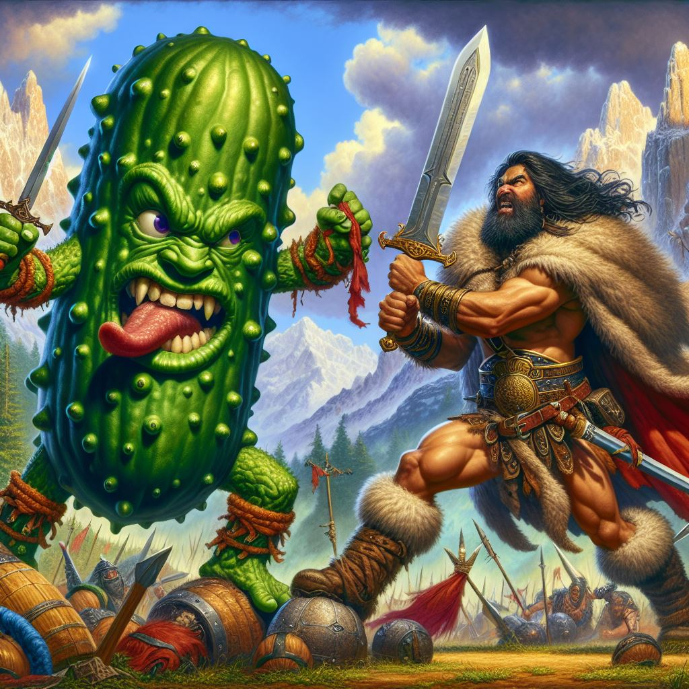

# BDD Angular Demo with Cucumber.js and Playwright

      

<table style="border:none">
<tbody>
  <tr>
    <td style="border:none;min-width:205px;text-align:center">
      
    </td>
    <td style="border:none">
      

        This project is a demonstration of the integration of Behavior-Driven Development (BDD) practices with a modern
        Angular 19 application, utilizing Cucumber.js for BDD testing and Playwright for automated browser testing.
      

    </td>
  </tr>
</tbody>
</table>

## Technologies Used

- **[Angular 19](https://angular.io)**: Modern web application framework
- **[TypeScript](https://www.typescriptlang.org/)**: Strongly-typed JavaScript for enhanced developer experience
- **[Cucumber.js](https://cucumber.io/)**: BDD test automation framework ([see for more info](https://cucumber.io/docs/guides/10-minute-tutorial))
- **[Playwright](https://playwright.dev/)**: Browser automation library for end-to-end testing
- **[TailwindCSS](https://tailwindcss.com/)**: Utility-first CSS framework for efficient styling

## The Value of BDD and Living Documentation

Behavior-Driven Development bridges the gap between technical and non-technical stakeholders by:

1. **Creating a common language**: Gherkin syntax (Given-When-Then) provides readable test scenarios that business stakeholders can understand
2. **Documenting specifications**: Test scenarios serve as living documentation that evolves with the application
3. **Validating acceptance criteria**: Ensures development meets business requirements
4. **Facilitating collaboration**: Promotes shared understanding across the entire team

This approach results in:

- Better alignment between business goals and development efforts
- Clearer requirements documentation
- More effective regression testing
- Improved communication between all stakeholders

## The Value of TailwindCSS

TailwindCSS provides significant advantages to development teams by:

1. **Accelerating UI Development**: Utility-first approach eliminates the need to write custom CSS, allowing faster implementation of designs.
2. **Maintaining Consistency**: Pre-defined design system with constraints for spacing, colors, typography, and more ensures visual consistency.
3. **Reducing CSS Complexity**:
   - No need to create and maintain complex CSS class naming systems
   - Minimizes CSS specificity issues and selector conflicts
   - Results in smaller bundle sizes through optimized production builds
4. **Improving Developer Experience**:
   - Write styles directly in your markup without context switching
   - IntelliSense support in modern IDEs provides autocomplete
   - Predictable styling behavior with direct control over every element
5. **Supporting Responsive Design**: Built-in responsive modifiers (sm:, md:, lg:, etc.) make creating adaptive interfaces straightforward.

This project demonstrates how TailwindCSS integrates with Angular components to create maintainable, consistent UI patterns while
reducing style-related technical debt.

## Documentation

1. For a quick setup and usage guide, see the [Quick Start Guide](docs/quick-start.md).
2. For Angular-specific instructions, refer to the [Angular Development Guide](docs/angular-development.md).
3. For an overview of the project structure, check out the [Project Structure Documentation](docs/project-structure.md).
4. For detailed instructions on how to implement a new scenario, please refer to the [Live Demo Documentation](docs/live-demo.md).
5. [Would You Like to Know More?](./docs/would-you-like-to-know-more.md): Additional articles and tutorials about the methods and technologies used in this project.

